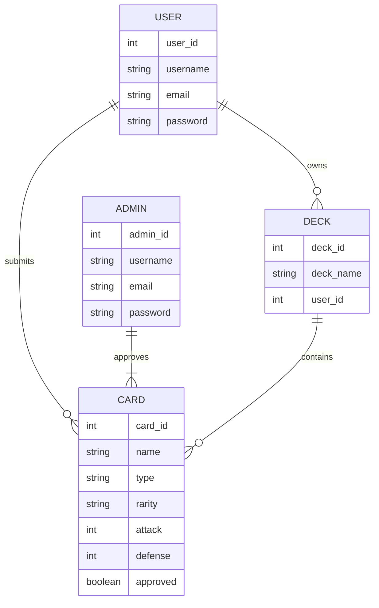
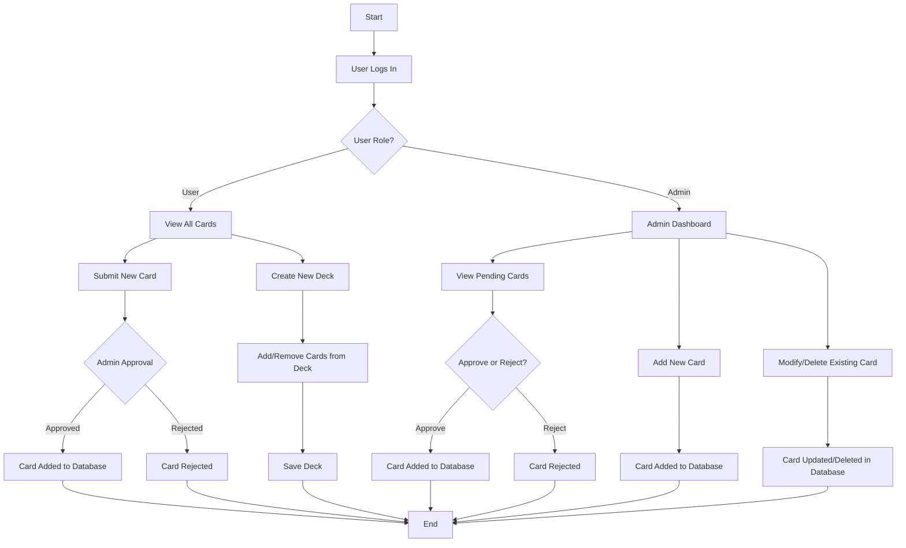
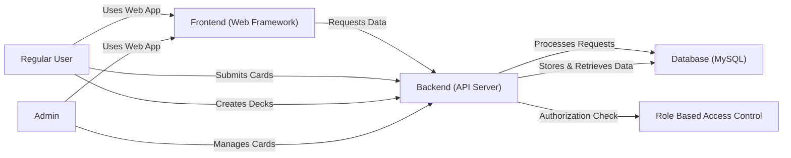

## git-practice-Aastha-Mahajan

### Pokémon Card Storage Web App Documentation

### 1. Entity-Relationship Diagram (ERD)

### 2. User Flow Diagram

### 3. System Architecture Diagram

### 4. API Endpoints Table

| Endpoint            | Method | Description                           | Authentication Required |
|---------------------|--------|--------------------------------------|------------------------|
| `/api/cards`       | GET    | Fetch all Pokémon cards              |  No                 |
| `/api/cards/:id`   | GET    | Get details of a specific card       |  No                 |
| `/api/cards`       | POST   | Submit a new card (user) or add a new card (admin) |  Yes (User or Admin)  |
| `/api/cards/:id`   | PUT    | Modify an existing card              |  Yes (Admin) |
| `/api/cards/:id`   | DELETE | Delete a card                        |  Yes (Admin) |
| `/api/decks`       | GET    | Fetch all decks of the user          |  Yes (User)  |
| `/api/decks/:id`   | GET    | Get details of a specific deck       |  Yes (User)  |
| `/api/decks`       | POST   | Create a new deck                    |  Yes (User)  |
| `/api/decks/:id`   | PUT    | Modify a deck (Add/Remove Cards)     |  Yes (User)  |
| `/api/decks/:id`   | DELETE | Delete a deck                        |  Yes (User)  |
| `/api/admin/cards/:id/approve` | PUT | Approve a user-submitted card |  Yes (Admin) |
| `/api/auth/login`  | POST   | User login                           |  No                 |
| `/api/auth/register` | POST | User registration                    |  No                 |
| `/api/auth/logout` | POST   | User logout                          |  Yes (User)  |

### 5. User Stories
 
1. **Deck Management:**  
   - *As a user, I want to create a deck so that I can organize my Pokémon cards for a game.*  
   - *As a user, I want to edit my deck so that I can update my strategy.*  
   - *As a user, I want to delete a deck so that I can remove unnecessary ones.*  

2. **Card Submission & Approval:**  
   - *As a user, I want to submit a new Pokémon card so that I can add it to my collection.*  
   - *As a user, I want to view the approval status of my submitted card so that I know when I can use it.*  

### Admin Stories  
3. **Card Approval System:**  
   - *As an admin, I want to review and approve submitted cards so that only valid cards are added to the system.*  
   - *As an admin, I want to reject wrong card submissions so that the database remains clean and accurate.*  

### My Name
Aastha Mahajan 

### Favorite Programming Language
Java and C++

### Fun Fact
I like doing calligraphy and journaling.

I like listening to music. 

## Summary of what I have learned
> I learned how to effectively use GitHub's version control, branching, merging, and resolving conflicts using my terminal.
> I got to improve my skills of creating and switching between the branches from the terminal.
> As well as learned how to resolve conflict in GitHub and understand what excatly casues it. 

>This assignment helped me understand Git's workflow better, as well as improved my ability to work with others on it.
> This will be helpful for me in more real-world software developement environment as well.

## Description of my collaboration experience
> I worked with another student, where we had to fork each others repositories. 
> As well as created and reviewd pull requests, while also giving each other feedback or suggestion for their README.md and goal.txt files.
> Also got the chance to merge each others files into our own repositories. 

